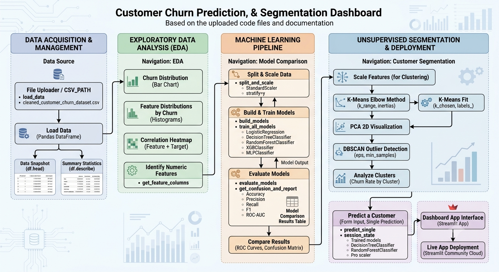

#  Customer Churn Prediction & Sales Dashboard

The Customer Churn Prediction and Sales Dashboard project leverages Data Analytics and Machine Learning to analyze customer behavior, predict churn probability, and visualize sales trends. This system is essential for businesses, e-commerce platforms, and service providers to enhance customer retention and optimize sales strategies. 

##  Project Overview

<div align="center">
  
</div>

---
🔗 **Live App:** [customer-churn-prediction-and-sales-dashboard-doneforzidio.streamlit.app](https://customer-churn-prediction-and-sales-dashboard-doneforzidio.streamlit.app)

---

## Key Features

- **Overview** — dataset snapshot, row/column counts, churn rate, summary statistics
- **EDA (Exploratory Data Analysis)** — churn distribution, feature histograms by churn, correlation heatmap
- **Model Comparison** — trains and evaluates 6 ML models side-by-side:
  - Logistic Regression
  - Decision Tree
  - Random Forest
  - XGBoost
  - LightGBM
  - Neural Network (MLP)

  Includes Accuracy, Precision, Recall, F1-score, ROC-AUC, ROC curves, and confusion matrix — all class-weighted to handle churn's natural class imbalance.
- **Customer Segmentation** — K-Means clustering (with elbow method + PCA visualization) and DBSCAN for outlier/anomaly detection
- **Predict a Customer** — live form to score a single customer's churn probability with any trained model

---

## 🛠️ Tech Stack

- **Language:** Python
- **Dashboard/UI:** Streamlit
- **Data Processing:** Pandas, NumPy
- **Machine Learning:** Scikit-learn, XGBoost, LightGBM
- **Visualization:** Matplotlib, Seaborn

---

##  Project Structure

```
churn/
├── app.py                                  # Main Streamlit dashboard
├── config.py                               # CSV path & target column config
├── data_utils.py                           # Data loading helpers
├── models.py                               # Model building, training, evaluation
├── clustering.py                           # K-Means & DBSCAN helpers
├── requirements.txt                        # Python dependencies
├── cleaned_customer_churn_dataset.csv      # Dataset
└── README.md

```
---

## 📊 Dataset

The dataset (`cleaned_customer_churn_dataset.csv`) contains 50,000 customer records with the following features:

| Column | Description |
|---|---|
| `tenure_months` | How long the customer has been active (months) |
| `monthly_usage_hours` | Average monthly usage in hours |
| `has_multiple_devices` | Whether the customer uses multiple devices (0/1) |
| `customer_support_calls` | Number of support calls made |
| `payment_failures` | Number of failed payments |
| `is_premium_plan` | Whether the customer is on a premium plan (0/1) |
| `churn` | Target variable — whether the customer churned (0/1) |

Churn rate in this dataset is ~2%, making it a highly imbalanced classification problem — handled here via class-weighting.

---

##  Running Locally

### 1. Clone the repository
```bash
git clone https://github.com/laharisetty29/Customer-Churn-Prediction-and-Sales-Dashboard.git
cd Customer-Churn-Prediction-and-Sales-Dashboard
```

### 2. Create and activate a virtual environment
```bash
python -m venv venv
venv\Scripts\activate        # Windows
source venv/bin/activate     # Mac/Linux
```

### 3. Install dependencies
```bash
pip install -r requirements.txt
```

### 4. Run the app
```bash
streamlit run app.py
```

The app will open at `http://localhost:8501`.

---

##  Deployment

This app is deployed on **Streamlit Community Cloud**. Any push to the `main` branch automatically triggers a redeploy.

---

##  Future Improvements

- Add sales-trend analysis if transaction/date/amount data becomes available
- Add SMOTE/oversampling as an alternative to class-weighting
- Add model persistence (save/load trained models instead of retraining each session)

---

##  Author

**Tirtha Brata Das**
- GitHub: [tirthabrata0407-cloud](https://github.com/tirthabrata0407-cloud))
